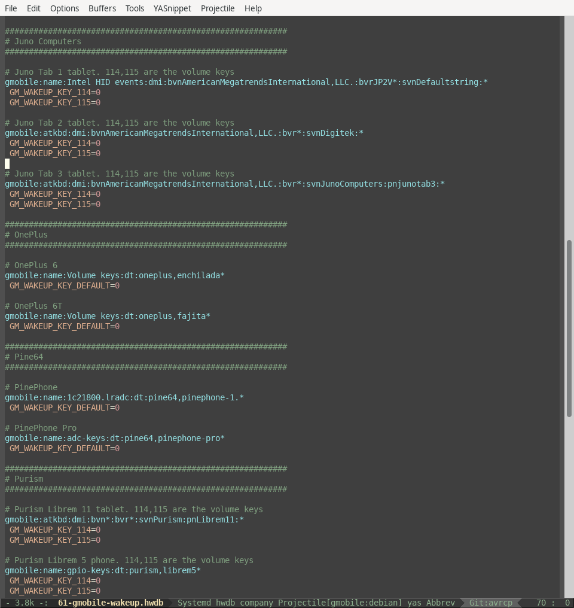

# A major mode for systemd hwdb files

This major mode provides some syntax highlighting for systemd's hwdb files.



## Usage 

Copy `systemd-hwdb.el` to `~/.emacs.d/vendor/`, then make sure it gets
loaded:

```lisp
(add-to-list 'load-path "~/.emacs.d/vendor")
(require 'systemd-hwdb-mode)
```
